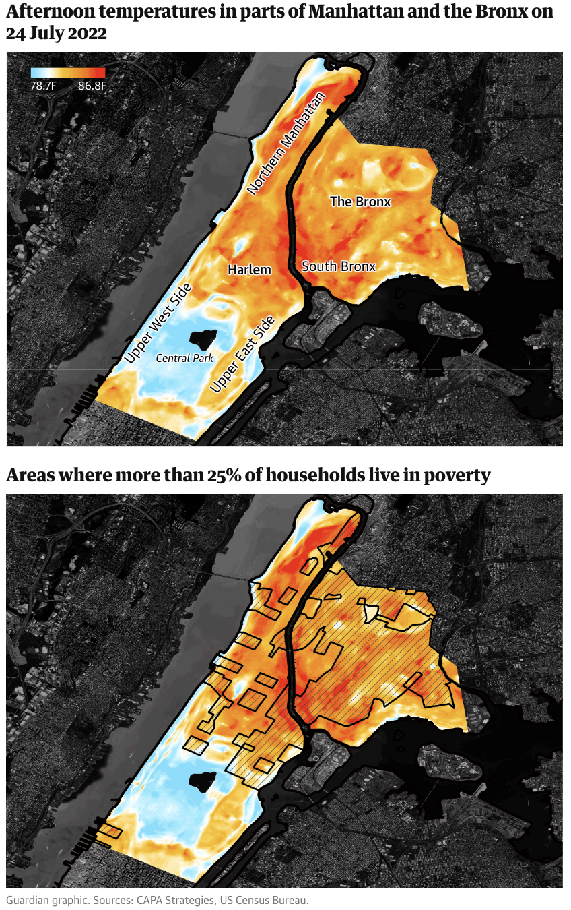

# Assignment 2: Critique by Design

## Viz to critique: Temperature difference in NYC

Source: [The Guardian](https://www.theguardian.com/us-news/2022/sep/07/new-york-heat-deaths-map-inequality)

This is a great visualization, with good color scale, details, title, map overlay. 

However, this displayed only data in one afternoon. I was interesting in seeing how the temperature in poorer area may be different during other time as well. 

## Sketch

<noscript></noscript><object class='tableauViz'  style='display:none;'><param name='host_url' value='https%3A%2F%2Fpublic.tableau.com%2F' /> <param name='embed_code_version' value='3' /> <param name='site_root' value='' /><param name='name' value='A3Iter1NYCStreetTemp&#47;Sheet1' /><param name='tabs' value='no' /><param name='toolbar' value='yes' /><param name='static_image' value='https:&#47;&#47;public.tableau.com&#47;static&#47;images&#47;A3&#47;A3Iter1NYCStreetTemp&#47;Sheet1&#47;1.png' /> <param name='animate_transition' value='yes' /><param name='display_static_image' value='yes' /><param name='display_spinner' value='yes' /><param name='display_overlay' value='yes' /><param name='display_count' value='yes' /><param name='language' value='en-US' /></object>
                

For this visualization, I wanted to 

# Redesign: Inspired by Andy Kriebel

i didnt realize you can move a measure as a dimension, that wouldve been helpful when i was doing my first sketch
also didnt know you can put the same dimension in column multiple times, which subdivide things nicely!!! i also wanted this when i made my sketch omg

we have the same question that sensor cluster seems to not match up with the heatmap

## Final Design

<noscript></noscript><object class='tableauViz'  style='display:none;'><param name='host_url' value='https%3A%2F%2Fpublic.tableau.com%2F' /> <param name='embed_code_version' value='3' /> <param name='site_root' value='' /><param name='name' value='A3Iter2NYCStreetTemp&#47;2019vs20182' /><param name='tabs' value='no' /><param name='toolbar' value='yes' /><param name='static_image' value='https:&#47;&#47;public.tableau.com&#47;static&#47;images&#47;A3&#47;A3Iter2NYCStreetTemp&#47;2019vs20182&#47;1.png' /> <param name='animate_transition' value='yes' /><param name='display_static_image' value='yes' /><param name='display_spinner' value='yes' /><param name='display_overlay' value='yes' /><param name='display_count' value='yes' /><param name='language' value='en-US' /></object>
                
