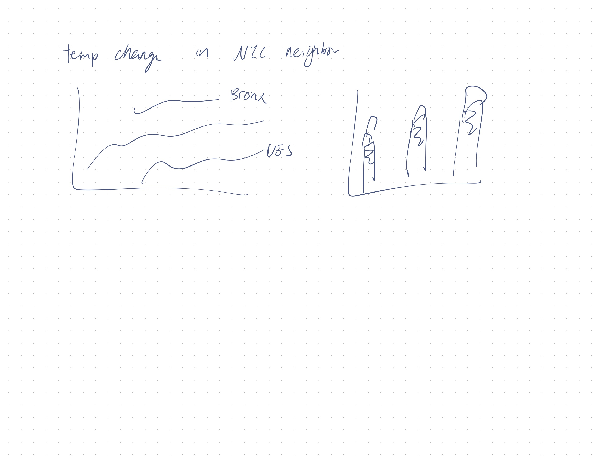

# Assignment 2: Critique by Design

**Viz to critique: Temperature difference in NYC**

<!--  -->

Source: MakeOver Monday 2023, No. 39, [The Guardian](https://www.theguardian.com/us-news/2022/sep/07/new-york-heat-deaths-map-inequality)

This is a great visualization, with good color scale, details, title, map overlay. 

However, this displayed only data in one afternoon. I was interesting in seeing how the temperature in poorer area may be different during other time as well. This leads to the following sketch...

## Sketch

First I started with some very rough brainstorming. I wanted to make it obvious that I am comparing against the different boroughs, and hopefully showing that Bronx is very high in temperature. I tried to follow Good Charts' advice and tried out a bar graph, even though I believed it wouldn't have worked. 

The following is my digitalized sketch. I made a line graph showcasing the different boroughs' average temperature across various days. 

<noscript></noscript><object class='tableauViz'  style='display:none;'><param name='host_url' value='https%3A%2F%2Fpublic.tableau.com%2F' /> <param name='embed_code_version' value='3' /> <param name='site_root' value='' /><param name='name' value='A3Iter1NYCStreetTemp&#47;Sheet1' /><param name='tabs' value='no' /><param name='toolbar' value='yes' /><param name='static_image' value='https:&#47;&#47;public.tableau.com&#47;static&#47;images&#47;A3&#47;A3Iter1NYCStreetTemp&#47;Sheet1&#47;1.png' /> <param name='animate_transition' value='yes' /><param name='display_static_image' value='yes' /><param name='display_spinner' value='yes' /><param name='display_overlay' value='yes' /><param name='display_count' value='yes' /><param name='language' value='en-US' /></object>
                

I had some difficulty showcasing the trend, and I tried to make the data look better by calculating a running average and to make the color chocie more intentional. I tested this with a couple friends, and they gave very similar feedback with some of the issues with my chart. Here are some of my questions and their summarized insights.

### Graduated student, mid 20s:
- Noticed that Bronx is the only colored line. 
- Noticed that they cannot see below 66 degree, and got confused. 

**Can you tell me what you think this is?**
- NYC Street temperature, but unsure whether this is air temperature vs street temperature

**Is there anything you find surprising or confusing?**
- The Y-axis and title seems to be conflicting
- The title says July and August, but Tableau allows the user to select other months as well
- The X-axis ranges from 0 to 32, which doesn't makes sense for the day of the month

**Who do you think is the intended audience?**
- Not sure who could use this graph, maybe NYC residents

**After learning about the context, what would you change?**
- This graph does not scream scream an issue; doesn’t necessary show that Bronx have higher temperature
- There is no indicator about the socioeconomics of each borough.

### Graduated student, early 20s:
- Noticed that you can select no or all months
- Noticed that the data could go below the axis
- Noticed all lines besides Bronx are not colored

**Can you tell me what you think this is?**
- NYC Street temperature, but got confused about the trend line
- Also disliked the Fahrenheit scale as they are more used to Celcius

**Who do you think is the intended audience?**
- People in Bronx or NYC in general, people who are interested in climate change

**After learning about the context, what would you change?**
- Perhaps a decending gradient for the different boroughs
- Should not be able to select the months
- The legend says "month of day" which is confusing

## Redesign & Inspiration by Andy Kriebel

After the feedback, I decided to look at the [Watch me Viz video by Andy Kriebel](https://www.youtube.com/watch?v=-dy10hFbiwA), which showcased some cool techniques:
- You could recategorize a measure as a dimension
- Putting the same "Date" dimension in the "column" seciton multiple times could make the x-axis subdivide more nicely, which was something I was looking for in my sketch
- You could use a number generator to make the graph look more clustered 

Additionally, both Andy and I recognized some difficulty with revisualizing this data. For example, the data set doesn't actually align with the dataset used in the visualization in the news article. The data provided does not give a good way to map out the sensors.  

Here is my final redesign. This is a chart mapping out the average temperature of a specific hour, on a specific day, for all days in July, grouped by boroughs. Because the data set is different, I wanted to tell a different story: instead of focusing on just Bronx, I decided to focus on all boroughs on July, one of the hottest month in NYC, and also focused on the hottest hours in a day, which is afternoon between 12-5pm. 

This chart also improved upon the feedback through these changes:
- I added in more context in the title and subtitle for the viewers
- I added an average line to show the difference between the boroughs
- I made sure the filter option is not selectable so the user would not get confused by the data

<noscript></noscript><object class='tableauViz'  style='display:none;'><param name='host_url' value='https%3A%2F%2Fpublic.tableau.com%2F' /> <param name='embed_code_version' value='3' /> <param name='site_root' value='' /><param name='name' value='A3Iter2NYCStreetTemp&#47;2019vs20182' /><param name='tabs' value='no' /><param name='toolbar' value='yes' /><param name='static_image' value='https:&#47;&#47;public.tableau.com&#47;static&#47;images&#47;A3&#47;A3Iter2NYCStreetTemp&#47;2019vs20182&#47;1.png' /> <param name='animate_transition' value='yes' /><param name='display_static_image' value='yes' /><param name='display_spinner' value='yes' /><param name='display_overlay' value='yes' /><param name='display_count' value='yes' /><param name='language' value='en-US' /></object>
                

