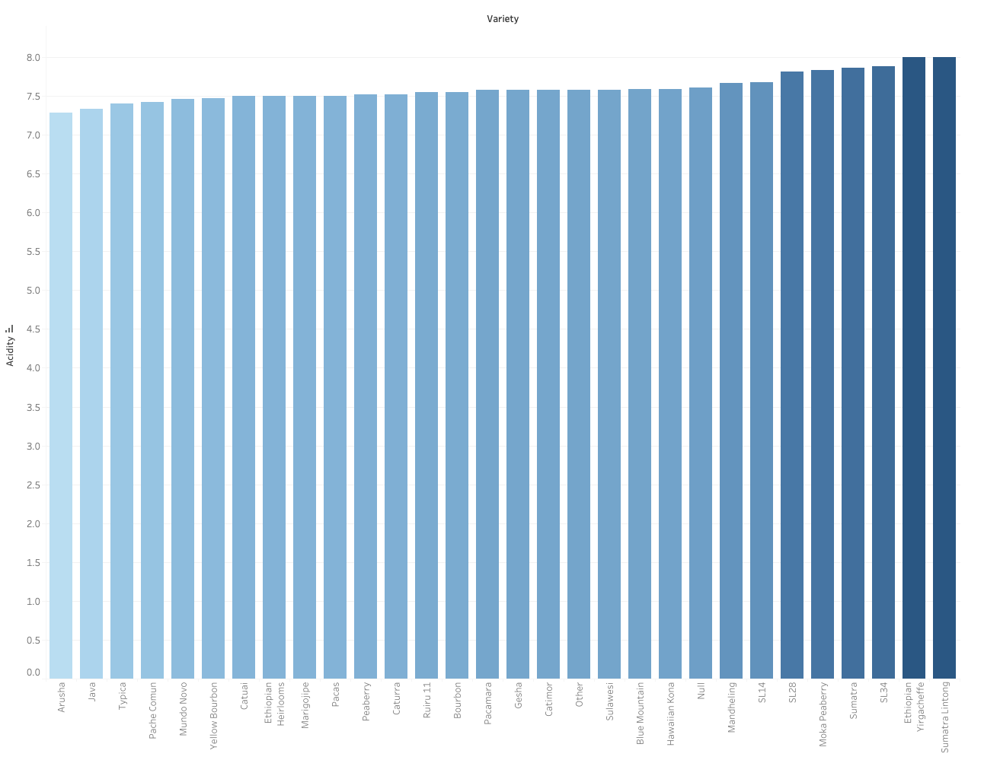
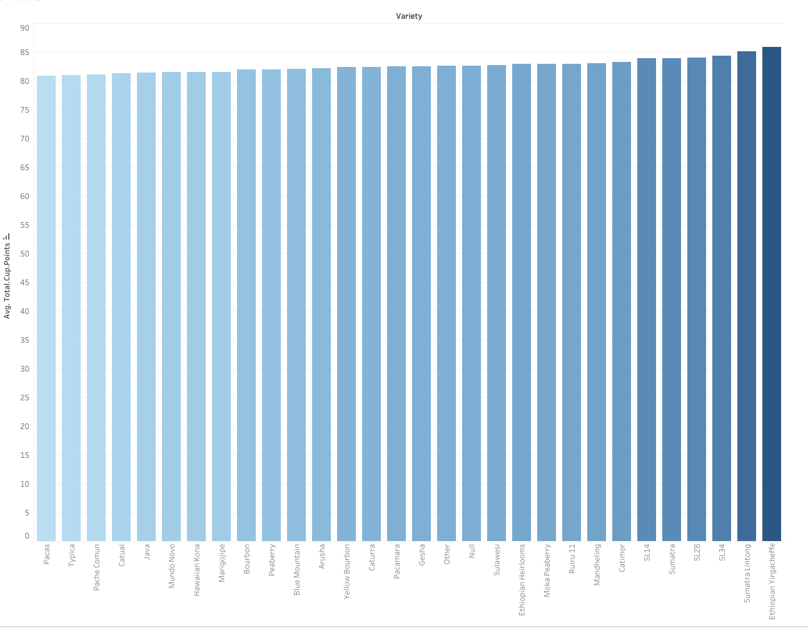

# Final Project: Part 1

## Outline

### Summary

I want to create a blog post on a coffee bean intro to people who want to start enjoying coffee by learning more about different beans and their attributes. 

### Storyboard & Sketches

**Intro**:  I am still sourcing data that could tell us a compelling story. Here is a potential way for me tell the story:

There are more coffee drinkers than ever (use one of the statistics). People are more likely to get introduced to coffee through various coffee chains, inviting cafes, and in other drinks like milkshake and boba.  That is my story as well, where I started drinking coffee because it is supposed to boost your metabolism, as well as keeping you awake during boring lectures.

However, I slowly realize coffee is more than just an Iced Americano from Starbucks, but it is an art form with cultural and social influences. I start to enjoy drinking coffee because I want to learn more about the art of making coffee and its complex flavor profile.

**Message:** You may also want to try out more coffee at home. One way to experience coffee in depth is to buy your own coffee beans/grounds and try to make espresso/pourover/French press out of them. And I want to help you with finding just the right coffee bean to get you started on the type of beans you may want to try first!

One thing that many coffee drinkers care about is the acidity. People could be very sensitive to acidic coffee. This graph shows the acidity of each coffee bean variety. Arusha and Java beans have the lowest average acidity, and may be a great way to start your coffee journey.

Another good quality measurement of coffee is cup points, which combines all the taste profile as well as coffee beans' attributes as well. As you may see, Sumatra Lintong and Ethiopian Yirgacheffe score very, very high on the cup points, which means they can provide great flavor profile for you. many stores in Shanghai (where I am from) sell Yirgacheffe espresso and pour over, and I personally realy enjoys them.

**Call to action:** If you are interested in these beans, chances are, you can go on to coffee shop websites and buy your favorite type of bean now. So go ahead and experiement with it!

## Data

[1340 Coffee Quality Reviews](https://github.com/jldbc/coffee-quality-database) webscraped from Coffee Quality Institute's trained reviewers. This will help me find out the flavor profile of each coffee bean.

Some findings on [2024 Coffee Consumption, Preferences, and Spending](https://www.driveresearch.com/market-research-company-blog/coffee-survey/)

All Japan Coffee Association, [research data collection](https://coffee.ajca.or.jp/data/statistics/)

[US Coffee Consumption Statistics](https://balancecoffee.co.uk/blogs/blog/coffee-consumption-statistics-us)

## Method & Medium

For this project, I plan to present in a blog format, with visualizations mainly created with Tableau. I like Tableau for how clean and interactive it is. Some classmates suggested using Shorthand for potentially more interesting visualization, so I will look into that as well. 